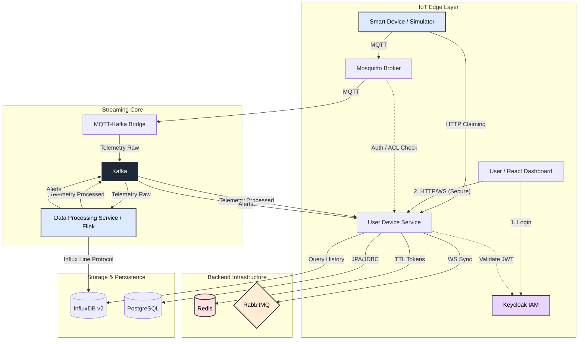

# Smart IoT Dashboard

> **Cloud-Native, Event-Driven IoT Platform for Real-Time Telemetry Processing & Device Management.**

Smart IoT Dashboard is a scalable IoT platform built on a microservices architecture. It ensures secure device connectivity, real-time telemetry stream processing, and state management via the "Digital Twin" concept.

The project demonstrates a **Modern Data Engineering** approach: moving away from monoliths to loosely coupled services (Kafka), using time-series data (InfluxDB), and Complex Event Processing (Flink CEP) instead of basic CRUD operations.

---

## 🏗 Architecture

The system is built on an **Event-Driven Architecture**. Devices and services are decoupled and communicate primarily through message brokers.

## 🔌 Key Features

* ✅ **Event-Driven Microservices:** Complete decoupling of components. Apache Kafka acts as the "central nervous system" and backpressure buffer, ensuring high throughput and fault tolerance.
* ✅ **Complex Event Processing (CEP):** **Apache Flink** is used for on-the-fly anomaly detection (e.g., "Temperature dropping while Heater is ON").
* ✅ **Scalable WebSockets (RabbitMQ):** Solved the "Split-Brain" problem for distributed WebSocket sessions. **RabbitMQ** is used as a STOMP Broker Relay to broadcast updates across multiple backend instances.
* ✅ **Secure Provisioning (Redis):** Short-lived **Redis** tokens (TTL 5 min) are used for the secure PIN-code device claiming flow, preventing replay attacks.
* ✅ **Secure Provisioning:** Implemented a secure device claiming protocol via **PIN-code** (similar to Smart TV login). Mosquitto uses a sidecar plugin to delegate Auth/ACL checks to the Backend via a **Custom Security Filter**.
* ✅ **Hybrid Persistence:**
    * **PostgreSQL:** Stores metadata, users, alerts, audit logs, and device commands.
    * **InfluxDB:** Stores high-frequency time-series telemetry data.

## Demo

### 1. Real-Time Control & Telemetry

## 🚀 Tech Stack

| Domain | Technology | Key Libraries & Details |
| :--- | :--- | :--- |
| **Backend** | **Java 17, Spring Boot 3** | Spring Security, OAuth2 Resource Server, JPA, WebSocket (STOMP), Flyway (Migration). |
| **Security** | **Keycloak** | Centralized Identity & Access Management (IAM), OAuth2/OIDC provider. |
| **Cache & Msg** | **Redis, RabbitMQ** | **Redis** for TTL tokens. **RabbitMQ** for internal WebSocket broadcasting. |
| **Streaming** | **Apache Kafka** | Used as the central Event Backbone and backpressure buffer. |
| **Processing** | **Apache Flink** | Complex Event Processing (CEP) for real-time anomaly detection and state management. |
| **IoT Edge** | **Eclipse Mosquitto** | MQTT Broker configured with a dynamic Auth Plugin delegating security checks to the Backend API. |
| **Frontend** | **React 18** | TypeScript, Material UI (MUI) for components, **Recharts** for real-time telemetry visualization. |
| **Persistence** | **PostgreSQL, InfluxDB** | **PostgreSQL** for relational data (users, devices, logs). **InfluxDB v2** for high-speed time-series telemetry (Flux language). |

## 🔮 Future Improvements (Roadmap)

The project architecture is designed for growth. The current backlog focuses on scalability validation and infrastructure hardening:

* [ ] **High-Load Stress Testing:** Implementation of a dedicated Python script (`stress_test.py`) to simulate **1000+ concurrent devices**. Goal: Validate Kafka partition strategy and Flink backpressure handling under load.
* [ ] **UX Scalability & Testing:** Refinement of frontend pagination and list management logic to ensure smooth rendering for users with large device fleets (50+ active devices).
* [ ] **CI/CD Automation:** Implementation of **GitHub Actions** pipelines for automated building, testing, and pushing Docker images to a registry. This will ensure code quality and streamline the deployment process.
* [ ] **Infrastructure Evolution:** Migration from local Docker Compose to **Kubernetes** (Helm Charts) for production-grade deployment capabilities.
* [ ] **API Documentation:** Adoption of the **AsyncAPI** specification to formally document Kafka topics and event schemas, complementing the existing OpenAPI (Swagger) documentation.
* [ ] **Storage Modernization:** Strategic migration to **InfluxDB 3.0** (IOx engine). This will enable native **SQL support** and columnar storage (Apache Parquet) for deeper analytics without proprietary languages like Flux.
